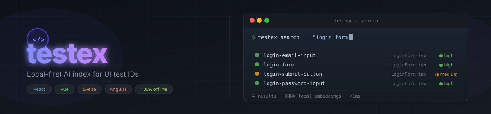

<div align="center">
  
</div>

<div align="center">

[](https://www.npmjs.com/package/testex)
[](LICENSE)
[](package.json)
[](#supported-frameworks)
[](#architecture)

**testex** scans your frontend source, embeds every `data-test*` ID with a local ONNX model,
and exposes the index through MCP, CLI, and REST — so AI agents find exactly the right
component to write tests for, every time.

[Quick Start](#quick-start) · [MCP Integration](#mcp-integration) · [CLI Reference](#cli-reference) · [Docs](#docs)

</div>

---

## Architecture

```
Source Code  ──▶  Parser  ──▶  ONNX Embeddings  ──▶  LanceDB
React/Vue/            ↑                                    │
Svelte/Angular    multi-fw                                 ▼
                                              MCP · REST · CLI
```

No cloud API. No Docker. ONNX model bundled (~32 MB). Everything runs after `npm install`.

---

## Quick Start

```bash
# 1. Install testex globally
git clone https://github.com/chuga2310/testex
cd testex && npm install && npm link

# 2. In any frontend project — one command does everything
cd /your-project
testex init           # indexes src/, creates .vscode/mcp.json
```

Then open **Copilot Chat → Agent mode** and ask:

> *"What test IDs are on the login page?"*
> *"Generate a Playwright test for CheckoutPage"*

---

## MCP Integration

testex works as an **MCP server** with Claude Code, GitHub Copilot, and Cursor.

### GitHub Copilot (VS Code 1.102+)

`testex init` creates `.vscode/mcp.json` automatically and indexes your source in one step:

```bash
testex init                   # auto-detects src/, app/, pages/
testex init --src ./frontend  # specify source directory
```

Click **Start** in the generated `.vscode/mcp.json`, switch Copilot Chat to **Agent mode**,
and the 13 tools are ready. Commit `.vscode/mcp.json` to share with your team.

### Claude Code / Cursor

Add to your project's `.mcp.json`:

```json
{
  "mcpServers": {
    "testex": {
      "command": "testex",
      "args": ["mcp"]
    }
  }
}
```

### Available MCP Tools

<details>
<summary><strong>13 tools</strong> — click to expand</summary>

| Tool | Description |
|------|-------------|
| `get_test_plan` | Full component summary: test IDs, elements, actions |
| `generate_playwright_test` | Ready-to-run `.spec.ts` for any component |
| `list_pages` | List all indexed page-level components |
| `find_by_action` | Find components by user action (`click`, `submit`, …) |
| `search_components` | Semantic search by natural language |
| `search_test_ids` | Exact substring search on test ID strings |
| `search_multi` | Multi-keyword union search |
| `search_must` | AND filter — all keywords must match |
| `get_user_flow` | Ordered fill/click steps for a component |
| `find_similar_components` | Components similar to a given one |
| `explain_page_structure` | Human-readable structure description |
| `list_all_test_ids` | Paginated dump of every indexed test ID |
| `index_stats` | Total components, test IDs, frameworks indexed |

</details>

---

## CLI Reference

```bash
# ── Setup (run once per project) ──────────────────────────────────────
testex init                        # auto-detect src/, create .vscode/mcp.json
testex init --src ./src            # specify source directory
testex init --force                # overwrite existing .vscode/mcp.json

# ── Indexing ──────────────────────────────────────────────────────────
testex index <path>                # index project
testex index <path> --reset        # drop + re-index
testex watch <path>                # live re-index on save

# ── Search ────────────────────────────────────────────────────────────
testex search "query"              # semantic search
testex search "id" --test-ids      # exact substring match
testex search login --union checkout   # multi-keyword (OR)
testex search email --must password    # multi-keyword (AND)

# ── Inspect ───────────────────────────────────────────────────────────
testex test-context <component>    # Playwright locators for a component
testex stats                       # index stats

# ── Servers ───────────────────────────────────────────────────────────
testex mcp                         # MCP server (stdio)
testex serve                       # REST API on :8000
```

### Confidence levels

| Symbol | Label | Meaning |
|--------|-------|---------|
| `●` | **high** | L2 distance < 0.4 — strong match |
| `◑` | **medium** | L2 distance 0.4 – 0.8 — likely match |
| `○` | **low** | L2 distance ≥ 0.8 — weak match |

---

## Supported Frameworks

| Framework | Extensions |
|-----------|-----------|
| React / JSX | `.tsx` `.jsx` `.ts` `.js` |
| Vue | `.vue` |
| Svelte | `.svelte` |
| Angular / HTML | `.html` |

---

## Example Files

> **These are starter examples** — copy, adapt, or delete them as needed.

| File | What it is |
|------|-----------|
| [`examples/playwright-agent.ts`](examples/playwright-agent.ts) | Script that auto-generates Playwright specs from the index |
| [`examples/generated/login-form.spec.ts`](examples/generated/login-form.spec.ts) | Sample generated spec (3 test cases) |
| [`skills/testex-skill.md`](skills/testex-skill.md) | MCP skill reference for AI agents — 13-tool catalog + decision tree |
| [`agents/playwright-writer.md`](agents/playwright-writer.md) | Agent definition: writes Playwright tests using the skill |
| [`agents/testex-explorer.md`](agents/testex-explorer.md) | Agent definition: explores the codebase via MCP |
| [`.claude/commands/write-tests.md`](.claude/commands/write-tests.md) | `/write-tests` slash command for Claude Code |

---

## Docs

| Language | Guide |
|----------|-------|
| 🇬🇧 English | [docs/en/guide.md](docs/en/guide.md) |
| 🇻🇳 Tiếng Việt | [docs/vi/guide.md](docs/vi/guide.md) |

---

## License

MIT
